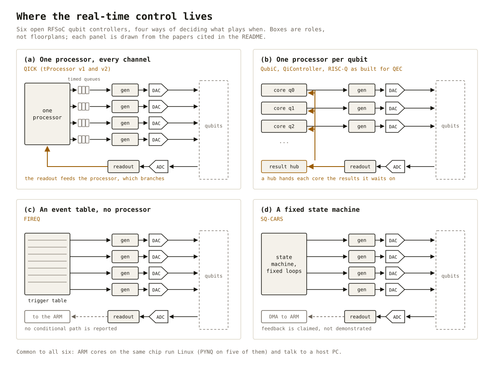
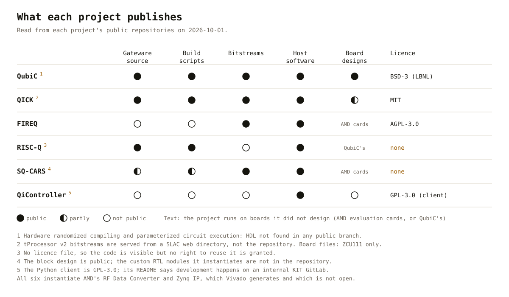
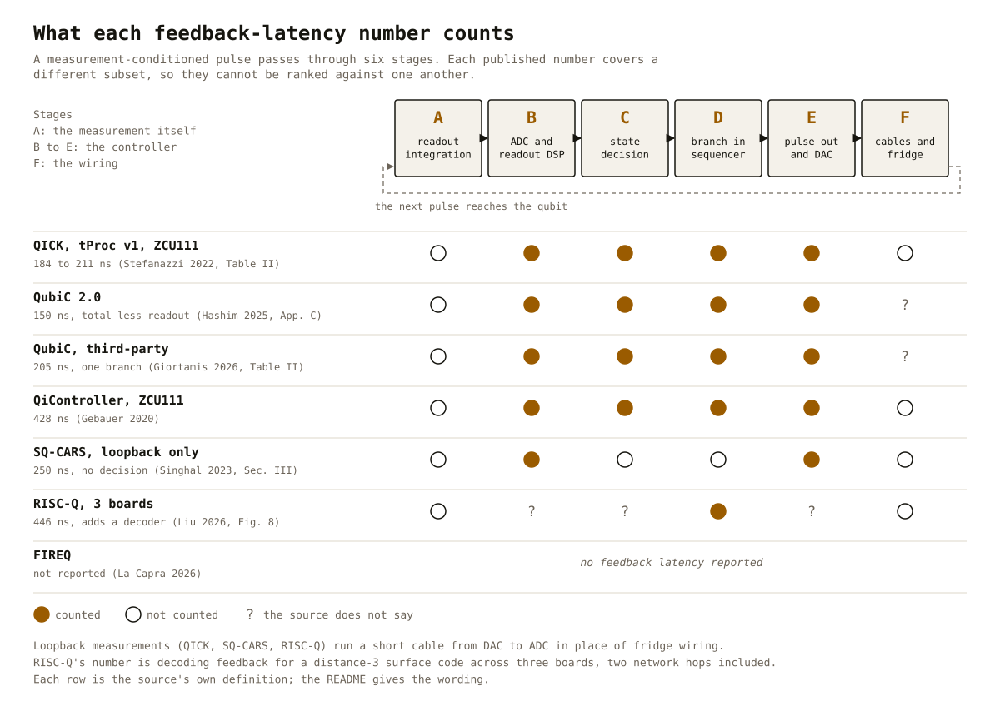

# rfsoc-qubit-control-survey

A side-by-side comparison of the open-source systems that control superconducting qubits from an
AMD RFSoC, built only from what their teams have published: papers, documentation and code.

It ranks nothing overall. The systems make different trade-offs, and the numbers they publish are
measured in different ways, so this page puts them next to each other with each number's
definition attached. It is for a lab choosing a stack, and for anyone building one.

Sources read up to 2026-10-01. The survey paper will be written in this repository once the
comparison settles; until then, this page is the survey.

## The systems

| System | Group | First on an RFSoC | Boards | Code | Licence |
|---|---|---|---|---|---|
| [QubiC](docs/systems/qubic.md) | Lawrence Berkeley National Laboratory | 2023 | ZCU216 | [GitLab](https://gitlab.com/LBL-QubiC) | BSD-3 (LBNL) |
| [QICK](docs/systems/qick.md) | Fermilab, with Chicago, Stanford and Princeton | 2021 | ZCU111, ZCU216, RFSoC 4x2 | [GitHub](https://github.com/openquantumhardware/qick) | MIT |
| [FIREQ](docs/systems/fireq.md) | Politecnico di Torino, INFN, Milano-Bicocca | 2026 | ZCU216 | [GitHub](https://github.com/vlsi-nanocomputing/FIREQ-Client) | AGPL-3.0 |
| [RISC-Q](docs/systems/risc-q.md) | University of Maryland | 2025 | ZCU216 | [GitHub](https://github.com/Wu-Quantum-Application-System-Group/RISC-Q) | none |
| [SQ-CARS](docs/systems/sq-cars.md) | IISc Bangalore | 2022 | ZCU111 | [GitHub](https://github.com/NeuRonICS-Lab/Quantum-Control-Electronics) | none |
| [QiController](docs/systems/qicontroller.md) | Karlsruhe Institute of Technology | 2020 | ZCU111 and later boards | [GitHub](https://github.com/quantuminterface/qiclib), client only | GPL-3.0 |

Each name links to a profile with every fact sourced: paper and section, or repository file.

**In scope**: controllers for superconducting qubits, built on an AMD Zynq UltraScale+ RFSoC, with
code public. Qibosoq, a layer on QICK, is covered in the QICK profile. Systems left out, and why,
are [below](#not-in-the-comparison).

**Method**: every entry comes from the papers, documentation and repositories, read on the date
above. Where a project's documentation and its RTL disagree, the RTL wins. Every number is quoted
with the source's own definition. No measurements of my own; this is a reading of the record.

## Where the real-time control lives



The deepest difference between these systems is what decides, in real time, which pulse plays when.
QICK has one processor that pushes timed instructions into a queue for each channel. QubiC,
QiController and the RISC-Q error-correction build give each qubit its own small core, and a hub
returns measurement results to the cores that wait on them. FIREQ plays a table of triggers, and
SQ-CARS runs fixed loops in a state machine. The choice decides how a measurement can change what
plays next, how programs are written, and how the design grows with the qubit count.

## Side by side

| | QubiC | QICK | FIREQ | RISC-Q | SQ-CARS | QiController |
|---|---|---|---|---|---|---|
| Real-time control | one core per qubit, custom 128-bit instructions | one tProcessor, a timed queue per channel | trigger table, no processor | RISC-V cores from a generator, programmed in C | fixed state machine | RISC-V sequencer per qubit cell |
| Converters as used | DAC 8 GS/s, ADC 2 GS/s | by build; ZCU216: DAC to 9.58 GS/s, ADC 2.46 GS/s | DAC 9.34 GS/s, ADC 2.33 GS/s | DAC 8 GS/s, ADC 2 GS/s | DAC 6.144 GS/s, ADC 3.84 GS/s | 4 GS/s each, complex baseband |
| Getting to GHz | direct; DAC in 2nd Nyquist zone by default | direct, to 10 GHz on the ZCU216 | direct, to 9.3 GHz | not stated; QEC build uses QubiC's front end | DAC mix mode, 4 to 9 GHz | external IQ mixers |
| Timing | 2 ns grid | 2.3 ns clock (ZCU216); 100 to 145 ps pulse placement | 1.7 ns events, 107 ps durations | 500 MHz clock | 192 MHz clock | 4 ns steps |
| Published build | 8 drive + 8 multiplexed readouts, or 14 + 14 | ZCU216: 16 generators, 10 readout outputs | 2 qubits | 14 qubits (QEC build) | up to 4 qubits | up to 10 cells |
| Readout multiplexing | 8 or 7 per line | polyphase filter bank, 8 outputs | tones summed on one DAC | 7 per readout DAC | 4 readout lines | frequency router per cell |
| State decision in fabric | threshold; optional neural network | threshold in the tProcessor, for feedback | not described | readout decoder | no; data to the ARM by DMA | threshold per cell |
| Conditional pulses | yes | yes | not described | yes | claimed, not shown | yes |
| Across boards | 3 boards: time protocol on GPIO, Aurora links | XCOM (alpha, 3 boards); Manarat from TII | planned | 3 boards: time protocol on GT links | no | ATCA system, 2024 |
| Host software | Python; QubiC-IR; OpenQASM 3 front end | Python on PYNQ; Qibosoq, QICKoDeS | Python client over TCP | C on the cores, Python host | Python on PYNQ | Python (qiclib, QiCode) |
| Shown on qubits | teleportation, mid-circuit feedback, GHZ states | RB 99.93%, 4 qubits read together, used by many labs | 1 qubit | none; RF loopback only | transmons, read out by external UHF | 5 transmons; fluxonium reset |

## What each project publishes



"Open source" covers a wide range here. QubiC and QICK publish the gateware source, build scripts,
bitstreams, software and board designs, under BSD-3 and MIT. FIREQ publishes a bitstream but not
its HDL. RISC-Q and SQ-CARS have no licence file, so their code can be read but not legally reused.
QiController publishes its client and keeps its gateware closed. All six depend on AMD's RF Data
Converter and processing-system IP, which Vivado generates and which is not open.

## Feedback latency: what each number counts



Every system that reports a feedback latency defines it differently, so the numbers cannot be
ranked. The table quotes each definition; the figure shows which stages of the loop each covers.
[Salathé et al.](https://doi.org/10.1103/PhysRevApplied.9.034011) (Eq. 1) and
[Ella et al.](https://arxiv.org/abs/2303.03816) (Fig. 5) give general definitions worth adopting.

| System | Number | What the source counts | Source |
|---|---|---|---|
| QICK, tProcessor v1, ZCU111 | 184 to 211 ns | DAC-to-ADC round trip over a short coax, plus condition and jump, plus the next pulse; summed from parts measured separately; not the integration window | [Stefanazzi 2022](https://doi.org/10.1063/5.0076249), Table II |
| QubiC 2.0 | 150 ns | "total feedback latency (not including readout time)"; method not stated | [Hashim 2025](https://doi.org/10.1103/PRXQuantum.6.010307), App. C |
| QubiC, measured by a third party | 205 ns | one branch: DAC, ADC, pulse preparation and discrimination; not readout | [Giortamis 2026](https://arxiv.org/abs/2604.25863), Table II |
| QiController, ZCU111 | 428 ns | last readout sample in to first sample of the conditioned pulse out; not cables, not readout | [Gebauer 2020](https://doi.org/10.1063/5.0011721) |
| SQ-CARS | 250 ns | DAC-to-ADC loopback round trip only; no decision | [Singhal 2023](https://doi.org/10.1109/TIM.2023.3305656), Sec. III |
| RISC-Q, three boards | 446 ns | decoding feedback for a distance-3 surface code, with a decoder and two network hops; readout emulated by RF loopback | [Liu 2026](https://arxiv.org/abs/2603.16203), Fig. 8 |
| FIREQ | none reported | | |

## Where published numbers disagree

- **FPGA resources.** For QICK's standard ZCU216 build, the RISC-Q paper reports 106,935 LUTs
  ([Liu 2025](https://arxiv.org/abs/2505.14902), Table I) and the FIREQ paper 141,348
  ([La Capra 2026](https://arxiv.org/abs/2608.29399), Table II). Resource counts depend on the
  build, and neither paper pins it down fully.
- **QICK's documentation and RTL.** The docs give the tProcessor v2 a 64-bit instruction and a
  256-deep call stack; the RTL has 72 bits and 8. See the [QICK profile](docs/systems/qick.md#where-the-sources-disagree).
- **Versioned papers.** QubiCML's inference time is 54 ns in arXiv versions 1 to 3 and 40 ns in
  versions 4 and 5 ([Vora 2024](https://arxiv.org/abs/2406.18807)).
- **One paper, three numbers.** The XCOM paper's abstract, Fig. 5 and conclusion give three
  different board-to-board skews ([Martin 2026](https://arxiv.org/abs/2603.18977)).
- **Older comparison tables age.** The SQ-CARS comparison table (2022) lists QICK without
  multi-tile sync ([Singhal 2023](https://doi.org/10.1109/TIM.2023.3305656), Table I), which QICK's
  later multi-board work uses ([Martin 2026](https://arxiv.org/abs/2603.18977)).

## Not in the comparison

| System | Why not | Source |
|---|---|---|
| ICARUS-Q, CQT Singapore | architecture published, no code released | [Park 2022](https://doi.org/10.1063/5.0081232) |
| HI-HCQC, Zhengzhou and UESTC | architecture published, no code released | [Liang 2026](https://arxiv.org/abs/2606.18642) |
| Presto, Intermodulation Products | commercial | [Tholén 2022](https://doi.org/10.1063/5.0101398) |
| HiSEP-Q 2.0, TU Munich | open (Apache-2.0), but a processor only, with no RF chain yet | [Guo 2026](https://arxiv.org/abs/2607.07372) |
| Manarat, TII | builds on QICK; covered in the QICK profile | [Silva 2026](https://doi.org/10.1063/5.0301360) |
| Systems on other converters | not an RFSoC: BBN on AD9164, Yang et al. on AD9739, QuBE and QuEL on AD9082 | [Kalfus 2020](https://doi.org/10.1109/TQE.2020.3042895), [Yang 2022](https://doi.org/10.1063/5.0085467) |

## Closest prior work

Several reviews mention these systems, but none compares their architectures side by side:

- [Rizvi et al. 2026](https://doi.org/10.1109/TQE.2026.3659400), a 52-page survey of every approach
  to control and readout, gives QICK, QubiC, SQ-CARS and ICARUS-Q a paragraph or two each.
- [Le et al. 2025](https://doi.org/10.1145/3711875.3737657), a four-page overview, mostly by the
  QubiC team, compares commercial systems in a table and the open ones in prose.
- [Shammah et al. 2024](https://doi.org/10.1063/5.0180987) surveys open quantum hardware broadly.
- [Nikbakhtnasrabadi and Weides 2025](https://doi.org/10.36227/techrxiv.173933155.57992122/v1) is a
  TechRxiv preprint that reviews FPGA control platforms, open and commercial. Its full text could
  not be retrieved for this survey.

The SQ-CARS, RISC-Q, FIREQ and Qibolab papers each carry a comparison table, written by the team
whose system it favours. This repository differs in keeping to one platform family, applying every
dimension to every system, and attaching each number's definition.

## Reading list

[references/README.md](references/README.md) groups every paper by system and topic, with a line
on why each matters. [references/papers.bib](references/papers.bib) has the BibTeX.

To rebuild the paper library locally:

```sh
python3 scripts/fetch_papers.py      # arXiv PDFs into papers/, and each paper's licence
python3 scripts/extract_figures.py   # the figures listed in references/figures.tsv, into extracted/
python3 scripts/figures.py           # this page's own figures
```

`papers/` and `extracted/` stay out of git: most arXiv preprints grant arXiv alone the right to
distribute them. A paper's figure appears in this repository only when the paper is CC BY, and then
with its credit.

## Corrections

Corrections are welcome as issues, especially from the teams behind these systems. Each claim names
its source, so a correction can point at the line it changes.

## Licence

Text and figures: [CC BY 4.0](LICENSE). Scripts: [MIT](scripts/LICENSE).
