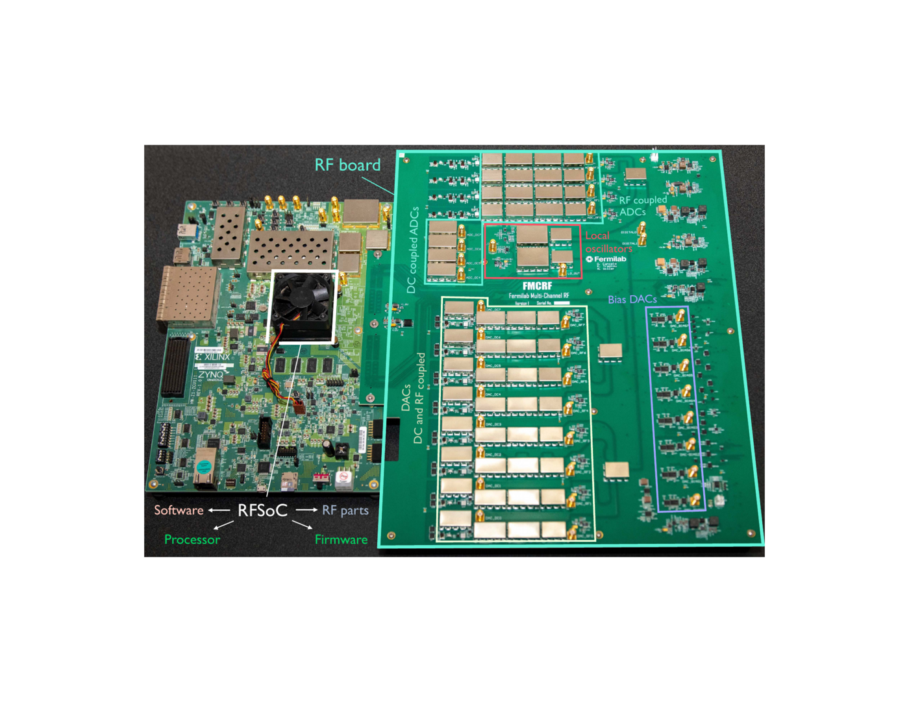

# QICK

The Quantum Instrumentation Control Kit, from Fermilab with the Schuster and Houck labs. One timed
processor, the tProcessor, schedules every channel through per-channel queues. It runs on three
boards, and other groups have built more layers on it than on any other system here.

| | |
|---|---|
| Group | Fermilab, with U. Chicago and later Stanford (Schuster lab) and Princeton (Houck lab) |
| Boards | ZCU111, ZCU216, RFSoC 4x2 |
| Code | [github.com/openquantumhardware/qick](https://github.com/openquantumhardware/qick) |
| Licence | MIT |
| Docs | [docs.qick.dev](https://docs.qick.dev) |
| Latest release | Python package `qick` 0.2.432 on PyPI (2026-09-16); GitHub Releases stop at v0.1.1 (2022) |

The QICK documentation contradicts the RTL in several places (instruction width, call-stack depth,
gain resolution). Where they disagree, this profile follows the papers and the RTL.

A ZCU111 with QICK's RF board. Figure 5 of Shammah et al., [Open hardware solutions in quantum technology](https://doi.org/10.1063/5.0180987), APL Quantum 1, 011501 (2024), CC BY 4.0. Rendered to PNG; otherwise unchanged.

## Hardware and converters

| Board | DACs | ADCs | Source |
|---|---|---|---|
| ZCU111 | 8 at up to 6.554 GS/s | 8 at 4.096 GS/s | [Stefanazzi 2022](https://doi.org/10.1063/5.0076249), Fig. 2 |
| ZCU216 | 16 at 9.85 GS/s | 16 at 2.5 GS/s | [Ding 2024](https://doi.org/10.1103/PhysRevResearch.6.013305), Sec. I |
| RFSoC 4x2 | 2 at 9.85 GS/s | 4 at 5 GS/s | [Ding 2024](https://doi.org/10.1103/PhysRevResearch.6.013305), Sec. I |

- Direct synthesis: up to 6 GHz on the ZCU111 using the second Nyquist zone
  ([Stefanazzi 2022](https://doi.org/10.1063/5.0076249), Sec. II-A), and mixer-free up to 10 GHz on
  the ZCU216 using the DAC's mix mode for higher zones
  ([Ding 2024](https://doi.org/10.1103/PhysRevResearch.6.013305), Secs. I and II-D).
- The standard tProcessor v2 build for the ZCU216 has 4 full-speed generators, 11 interpolated
  ones and a multiplexed one; 2 readouts plus a polyphase-filter-bank readout with 8 outputs
  (`firmware` block-design Tcl).
- Front ends: AMD's XM500 (ZCU111) or XM655 (ZCU216) balun cards, or QICK's own RF board for the
  ZCU111 (schematics and Gerbers in the repository;
  [Stefanazzi 2022](https://doi.org/10.1063/5.0076249), Sec. II-B). Boxed ZCU216 systems with RF
  daughtercards are sold by several vendors; their schematics are not in the repository.

## Real-time control

- **tProcessor v1**: a 64-bit processor with about 20 instructions. Timed instructions go into one
  queue per channel and are released against a 48-bit master clock
  ([Stefanazzi 2022](https://doi.org/10.1063/5.0076249), Sec. III-A, Fig. 8).
- **tProcessor v2**: 72-bit instructions, a 5-stage pipeline, separate core and timing clocks, a
  dispatcher with wave, data and trigger queues each entry tagged with a 48-bit time (RTL
  `qcore_cpu.sv`; `docs/source/tprocv2_trm.rst`). On the ZCU216 the timing clock is 430 MHz,
  about 2.3 ns ([Martin 2026](https://arxiv.org/abs/2603.18977), Secs. IV and V).
- Pulse timing finer than a clock comes from envelope samples: 100 to 145 ps on the ZCU216
  ([Ding 2024](https://doi.org/10.1103/PhysRevResearch.6.013305), Secs. I and IV).
- Status: the pip package ships only v1 bitstreams; v2 bitstreams are served from a SLAC web
  directory, and the docs call v2 "beta" on one page and v1 "legacy" on another.

## Signal generation

- Full-speed generator: an envelope at the full DAC rate times a DDS, 16 lanes in parallel, 32-bit
  frequency and phase (about 1.5 Hz at 6 GS/s), 16-bit gain in the RTL
  ([Stefanazzi 2022](https://doi.org/10.1063/5.0076249), Sec. III-B; `ctrl_sg_v6.sv`).
- Phase coherent: each frequency's phase follows a sine running from the master clock, and the
  ZCU216 firmware adds a synchronous phase reset
  ([Ding 2024](https://doi.org/10.1103/PhysRevResearch.6.013305), Sec. II-C).
- Interpolated generators run the envelope at 1/16 of the DAC rate; multiplexed generators play up
  to 8 constant tones on one DAC
  ([Ding 2024](https://doi.org/10.1103/PhysRevResearch.6.013305), Secs. II-A and II-B).

## Readout

- DDS down-conversion, FIR filter, decimation by 8, and an averaging buffer that keeps one IQ point
  per trigger plus raw decimated samples ([Stefanazzi 2022](https://doi.org/10.1063/5.0076249),
  Sec. III-C, Fig. 10).
- Multiplexed readout through a polyphase filter bank
  ([Ding 2024](https://doi.org/10.1103/PhysRevResearch.6.013305), Sec. II-A, Fig. 3).
- State classification is done in software, except for feedback, where the tProcessor compares the
  accumulated IQ value against a threshold. A neural-network discriminator built with hls4ml is a
  research add-on ([Di Guglielmo 2025](https://doi.org/10.1109/TQE.2025.3604712)).

## Feedback

The readout streams its accumulated IQ value into the tProcessor, which branches on it
([Stefanazzi 2022](https://doi.org/10.1063/5.0076249), Sec. III-C).

| Number | Definition | Source |
|---|---|---|
| 184 to 211 ns | tProcessor v1 on the ZCU111: DAC-to-ADC round trip over a short coax (90 to 117 ns) plus condition and jump (42 ns) plus the next pulse (52 ns), summed from parts measured separately with an internal logic analyzer; excludes the integration window | [Stefanazzi 2022](https://doi.org/10.1063/5.0076249), Sec. IV-A, Table II |

No end-to-end number has been published for tProcessor v2. Used for active reset by others, for
example [Zhang 2024](https://doi.org/10.1103/PRXQuantum.5.020326), App. G.

## Multi-board

- Two ZCU111 boards locked to one reference ([Stefanazzi 2022](https://doi.org/10.1063/5.0076249),
  App. A).
- **XCOM**, QICK's own: full-mesh LVDS through an FMC card and a hub, 20 ps skew across 3 boards
  in Fig. 5, about 186 ns per 32-bit word ([Martin 2026](https://arxiv.org/abs/2603.18977)). Its
  firmware is on a public branch, not `main`, and the paper's abstract, figure and conclusion give
  three different skew figures.
- **Manarat**, from TII, a third party: a wired-AND sync bus and a modified tProcessor, under 100
  ps between 2 ZCU216 boards controlling 10 flux-tunable qubits
  ([Silva 2026](https://doi.org/10.1063/5.0301360)). The paper does not say whether its code is
  available.

## Software

Python on PYNQ on the ARM cores, with drivers attached to firmware blocks automatically
([Ding 2024](https://doi.org/10.1103/PhysRevResearch.6.013305), Sec. I). tProcessor v1 programs
subclass `AveragerProgram`; v2 programs use `AveragerProgramV2`, compiled through macros, an
assembly layer and an assembler (`asm_v2.py`). Remote use through a Pyro4 proxy. Other groups'
layers: Qibosoq for Qibo (below), QICKoDeS for QCoDeS, QICK-DAWG for NV centres
([Riendeau 2023](https://arxiv.org/abs/2311.18253)), SpinQICK for spin qubits.

### Qibosoq

A server from the Qibo team that runs on the board and keeps one QICK instance alive, so the
converters do not re-initialize and lose phase between runs. Commands arrive as JSON over TCP.
It uses tProcessor v1 programs, sweeps drive frequency, amplitude, timing and phase in real time,
and lists feedback as "under development". Apache-2.0, latest release 0.1.4 (2025-07-21)
([Carobene 2025](https://doi.org/10.1088/2058-9565/adcd97), Sec. II, Table I;
[qiboteam/qibosoq](https://github.com/qiboteam/qibosoq)). Through it, Qibolab benchmarks QICK
boards against commercial controllers ([Efthymiou 2024](https://doi.org/10.22331/q-2024-02-12-1247)).

## Demonstrated with qubits

- A 3D transmon: T1 119.5 µs, single-shot readout 94.7% without a parametric amplifier,
  randomized benchmarking 99.93% ([Stefanazzi 2022](https://doi.org/10.1063/5.0076249), Fig. 14).
- Four qubits read out together, flux-pulse predistortion, fluxonium gates above 99.9%
  ([Ding 2024](https://doi.org/10.1103/PhysRevResearch.6.013305)).
- Used in work by others, for example [Bland 2025](https://doi.org/10.1038/s41586-025-09687-4)
  (alongside a commercial controller) and
  [Anferov 2024](https://doi.org/10.1103/PRXQuantum.5.030347). The QICK docs list 56 papers on
  superconducting circuits (`docs/source/papers.rst`, 2026-09-11).

## Where the sources disagree

- tProcessor v2 instruction width: 64-bit in the firmware overview, 72-bit in the reference manual
  and the RTL. Call stack: 256 in the docs, 8 in the RTL.
- Gain: 32-bit in the docs, 16-bit in the `sg_v6` RTL.
- Direct synthesis on the ZCU216: "up to 6 GHz" on the docs front page, 10 GHz in
  [Ding 2024](https://doi.org/10.1103/PhysRevResearch.6.013305).
- FPGA resources for the same standard build: 106,935 LUTs in
  [Liu 2025](https://arxiv.org/abs/2505.14902), 141,348 in
  [La Capra 2026](https://arxiv.org/abs/2608.29399). Which build each used is not fully stated.
