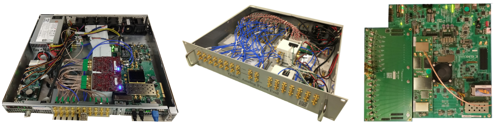

# QubiC

Lawrence Berkeley National Laboratory's control system, run on the Advanced Quantum Testbed. On
the RFSoC since QubiC 2.0: one small processor core per qubit, a shared module that hands
measurement results to the cores, and a Python stack from a gate-level IR down to machine code.

Like every profile here, this one uses only the published papers and the upstream
repositories.

| | |
|---|---|
| Group | LBNL, Advanced Quantum Testbed |
| Board | ZCU216 only, per the gateware and software READMEs |
| Code | [gitlab.com/LBL-QubiC](https://gitlab.com/LBL-QubiC): `gateware`, `distributed_processor`, `software`, `experiments/qubitconfig` |
| Licence | LBNL modified BSD-3 (BSD-3-Clause plus an enhancements grant-back clause) |
| Docs | [lbl-qubic.gitlab.io](https://lbl-qubic.gitlab.io) |
| Latest release | `software` and `distproc` 25.08.0 (2025-08-12); gateware `bitfile_8_2_25.06` (2025-08-31) |

QubiC 1.0 (left, middle) and QubiC 2.0 (right). Figure 4 of Shammah et al., [Open hardware solutions in quantum technology](https://doi.org/10.1063/5.0180987), APL Quantum 1, 011501 (2024), CC BY 4.0. Placed on a white ground; otherwise unchanged.

## History

QubiC 1.0 ran on a Virtex-7 VC707 with FMC120 converter cards and in-house IQ mixing modules
([Xu 2021](https://doi.org/10.1109/TQE.2021.3116540), Sec. II;
[Xu 2021b](https://doi.org/10.1063/5.0055906)). QubiC 2.0 moved to the ZCU216 with direct RF
synthesis ([Xu 2023](https://arxiv.org/abs/2309.10333)). The repositories were created in 2019;
the first RFSoC gateware tag is `v2.01` (2023-06-21).

## Hardware and converters

- The ZCU216 has 16 DACs at up to 9.85 GS/s and 16 ADCs at 2.5 GS/s. QubiC runs the DACs at
  8 GS/s and the ADCs at 2 GS/s, with a 500 MHz fabric clock
  ([Xu 2023](https://arxiv.org/abs/2309.10333), Sec. II-A;
  [Fruitwala 2024](https://arxiv.org/abs/2404.15260), Sec. VII).
- Drive is synthesized directly by the DACs; the software defaults put the DAC in the second
  Nyquist zone and the ADC in the first (`software/scripts/server_config.yaml`).
- LBNL's own analog front-end board carries baluns, low-noise amplifiers and regulators in the
  footprint of AMD's XM655 card ([Xu 2023](https://arxiv.org/abs/2309.10333), Sec. II-B, Fig. 1).
  AC- and DC-coupled versions are published under CERN OHL v1.2 in `lbl-boards/rfsocdaughter`.
- Builds trade drive for readout channels. `ZCU216_8_2`: 8 drive DACs, one summed readout DAC
  carrying 8 multiplexed readouts, one ADC. `ZCU216_14_2`: 14 drive DACs, 2 readout DACs, 2 ADCs,
  7 qubits per readout line (gateware `dsp_config.yaml`; gateware wiki).

## Real-time control

- Distributed: one processor core per qubit, no central sequencer. A function processor (FPROC)
  collects measurement results and serves them to the cores
  ([Fruitwala 2024](https://arxiv.org/abs/2404.15260), Secs. III and VII).
- 128-bit instructions: pulse write, register ALU, jumps (immediate, conditional, on FPROC
  results), clock increment, sync, done. 16 registers of 32 bits
  ([Fruitwala 2024](https://arxiv.org/abs/2404.15260), Sec. III-A; `hdl/instr_params.vh`).
- A pulse is triggered at a 32-bit start time counted in 500 MHz cycles: a 2 ns grid
  ([Fruitwala 2024](https://arxiv.org/abs/2404.15260), Sec. IV-A).
- A pulse instruction takes at least 4 cycles; register and control-flow instructions take 4 to 7
  ([Xu 2023](https://arxiv.org/abs/2309.10333), Sec. III-B).
- 2048 instructions per core; one core costs 387 LUTs, 401 flip-flops and 2 BRAMs
  ([Fruitwala 2024](https://arxiv.org/abs/2404.15260), Sec. VII-A, Fig. 8).

## Signal generation

- Each signal generator multiplies a CORDIC carrier by an envelope from memory; a core drives up to
  three of them: qubit drive, readout drive, readout local oscillator (gateware wiki;
  [Fruitwala 2024](https://arxiv.org/abs/2404.15260), Sec. III).
- Envelope words are 16-bit I and 16-bit Q; the `8_2` build gives each generator 4096 words. Drive
  envelopes are interpolated by 4 (2 GS/s), readout envelopes by 16 (`dsp_config.yaml`).
- Per pulse: 16-bit amplitude, 17-bit phase, a frequency chosen from a table by a 9-bit address
  (ISA wiki; [Fruitwala 2024](https://arxiv.org/abs/2404.15260), Fig. 4).

## Readout

- ADC, digital mixing against a per-qubit local-oscillator generator, then integration into a
  64-bit IQ accumulator (gateware wiki). A buffer captures raw traces
  ([Xu 2023](https://arxiv.org/abs/2309.10333), Sec. III-B).
- State discrimination in fabric: a sign threshold on one quadrature
  ([Xu 2023](https://arxiv.org/abs/2309.10333), Sec. VI-A;
  [Hashim 2025](https://doi.org/10.1103/PRXQuantum.6.010307), App. C).
- Optional neural-network discriminator for qubits and qutrits (QubiCML, gateware tag
  `qubicml_1.0`), 40 ns per inference after integration
  ([Vora 2024](https://arxiv.org/abs/2406.18807), v5, Sec. II).

## Feedback

The discriminated bit goes to the FPROC; a core instruction waits for it and branches
([Fruitwala 2024](https://arxiv.org/abs/2404.15260), Sec. III-B). Published numbers, each with its
own definition:

| Number | Definition | Source |
|---|---|---|
| 150 ns | "total feedback latency (not including readout time)"; method not stated | [Hashim 2025](https://doi.org/10.1103/PRXQuantum.6.010307), App. C; [Hashim 2025b](https://doi.org/10.1063/5.0291637), App. C |
| 205 ns | one branch, counting DAC, ADC, pulse preparation and discrimination, not readout; third-party | [Giortamis 2026](https://arxiv.org/abs/2604.25863), Table II |
| 600 ns | a configured hold for a result to cross between boards, not a minimum | [Xu 2025](https://arxiv.org/abs/2506.09856), Sec. V |

## Multi-board

An LMK04828 clock in zero-delay mode plus the RF data converter's multi-tile sync; a minimal
precision-time protocol over a GPIO ring; Aurora 64B/66B links over SFP fibre at 10.3125 Gb/s for
measurement results. Shown on 3 ZCU216 boards with zero counter offset over 16 h
([Xu 2025](https://arxiv.org/abs/2506.09856), Secs. III to V).

## Software

Python on PYNQ 3.0 on the ARM cores; an XML-RPC board server and a job server. Programs are written
in QubiC-IR (gate, pulse and control-flow levels), compiled per core to assembly and then to
machine code (`distproc`). An OpenQASM 3 front end, and True-Q and pyGSTi transpilers
([Fruitwala 2024](https://arxiv.org/abs/2404.15260), Secs. V and VI; repository READMEs).
Calibration and data management: `qubitconfig`, `chipcalibration`, and QubiCSV
([Brahmbhatt 2024](https://doi.org/10.1038/s41598-024-72584-9)).

## Demonstrated with qubits

- Active reset and a conditional bit flip ([Xu 2023](https://arxiv.org/abs/2309.10333), Figs. 7 and 8).
- Teleportation on an 8-transmon processor ([Fruitwala 2024](https://arxiv.org/abs/2404.15260), Sec. VIII).
- Mid-circuit measurement with readout correction
  ([Hashim 2025](https://doi.org/10.1103/PRXQuantum.6.010307)), and GHZ states between non-adjacent
  qubits by feedback ([Hashim 2025b](https://doi.org/10.1063/5.0291637)).
- Randomized compiling and parameterized circuits in hardware
  ([Fruitwala 2024b](https://arxiv.org/abs/2406.13967);
  [Rajagopala 2024](https://arxiv.org/abs/2409.03725)).
- Users outside LBNL: Oxford ([Cao 2024](https://arxiv.org/abs/2402.09532), App. D;
  [Alghadeer 2025](https://arxiv.org/abs/2505.22276)).

## Openness, in detail

The QubiC 2.0 paper calls the gateware "fully open-source" ([Xu 2023](https://arxiv.org/abs/2309.10333),
Sec. III). Three qualifications, as of 2026-10-01:

- Like every system here, it instantiates AMD's RF Data Converter and Zynq IP from Tcl, generated
  by Vivado 2022.1.
- The HDL behind hardware randomized compiling and parameterized circuit execution was not found in
  any public branch of `gateware` or `distributed_processor`, though the compiler schedules their
  instructions. LBNL's Intellectual Property Office lists both as patent pending.
- An `rfsoc-4x2-support` branch exists but is not documented as supported.

## Where the sources disagree

- QubiCML's inference time is 54 ns in arXiv versions 1 to 3 and 40 ns in versions 4 and 5
  ([Vora 2024](https://arxiv.org/abs/2406.18807)).
- Bit widths in [Fruitwala 2024](https://arxiv.org/abs/2404.15260) Fig. 2 (phase 14-bit, frequency
  24-bit) match QubiC 1.0; its text and Fig. 4 give the 2.0 format.
- The 1.8 ps and 7.4 ps jitter figures appear in both [Xu 2023](https://arxiv.org/abs/2309.10333)
  and [Xu 2025](https://arxiv.org/abs/2506.09856); they describe one output's noise, not
  board-to-board skew.
