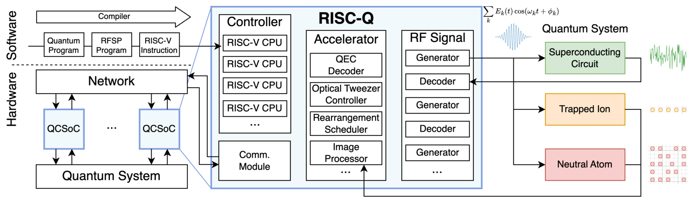

# RISC-Q

A generator, written in SpinalHDL, for quantum-control systems-on-chip built around RISC-V cores,
from Xiaodi Wu's group at the University of Maryland. Programs are C, compiled with standard
RISC-V toolchains. A 2026 paper, with QubiC authors, builds a three-board error-correction system
on it.

| | |
|---|---|
| Group | U. Maryland; the QEC paper adds LBNL QubiC authors |
| Board | ZCU216 |
| Code | [github.com/Wu-Quantum-Application-System-Group/RISC-Q](https://github.com/Wu-Quantum-Application-System-Group/RISC-Q) |
| Licence | none: no licence file, so no right to reuse is granted |
| Docs | README; "documentation is under construction" |
| Latest release | no tags; default branch `dev` |

Figure 1 of Liu et al., [RISC-Q](https://arxiv.org/abs/2505.14902) (2025), CC BY 4.0. Placed on a white ground; otherwise unchanged.

## Hardware and converters

16 DACs and 8 ADCs at a 500 MHz fabric clock; the worked example runs DACs at 8 GS/s and ADCs at
2 GS/s ([Liu 2025](https://arxiv.org/abs/2505.14902), Secs. IV-B and V-A). The QEC system uses
three ZCU216s in QubiC chassis with QubiC's front-end boards, 14 qubits per board, 7 sharing each
readout DAC ([Liu 2026](https://arxiv.org/abs/2603.16203), Sec. V-A, Figs. 2 and 6).

## Real-time control

RISC-V cores with a global timer; parameters for pulses reach the RF blocks through memory-mapped
registers or custom instructions and are released from timed queues at their timestamps
([Liu 2025](https://arxiv.org/abs/2505.14902), Secs. III and IV, Fig. 3). Core count is a
parameter of the generator; the QEC system uses one core per qubit
([Liu 2026](https://arxiv.org/abs/2603.16203), Fig. 2).

## Signal generation and readout

A carrier from a lookup table or CORDIC, times an envelope from memory. The readout decoder
demodulates, low-pass filters and decides the state; a raw buffer is optional
([Liu 2025](https://arxiv.org/abs/2505.14902), Sec. IV-B).

## Feedback

Conditional gates by branch, or without one by preloading both pulses and selecting by register
([Liu 2025](https://arxiv.org/abs/2505.14902), Sec. V-B). The QEC system reports 446 ns of
decoding feedback for a distance-3 surface code with 3 rounds, across three boards, measured with
synchronized timers over 10,000 runs, with readout emulated through an RF loopback rather than
qubits. By stage: aggregation 29 ns, network 157 ns, pre-decoding 20 ns, decoder 56 ns,
distribution 25 ns, network 155 ns, leaf 9 ns ([Liu 2026](https://arxiv.org/abs/2603.16203),
Sec. V-B, Figs. 7 and 8).

## Multi-board

A shared reference clock and a minimal precision-time protocol over the GT transceivers with a
custom 64B/66B link, about 156 ns per hop; sub-nanosecond timer alignment
([Liu 2026](https://arxiv.org/abs/2603.16203), Secs. IV-B and IV-C).

## Software

C on the RISC-V cores; an HTTP server on PYNQ on each board; a Python host library for several
boards ([Liu 2026](https://arxiv.org/abs/2603.16203), Sec. IV-E).

## Demonstrated with qubits

None in either paper. The latency results are from RF loopback.

## Worth knowing

The RISC-Q paper compares its design with QICK and QubiC in lines of HDL and in LUTs and flip-flops
per DAC (Sec. V, Table I), and says plainly that "fair benchmarking remains difficult due to
differing architectures and the absence of standard evaluation tools."
