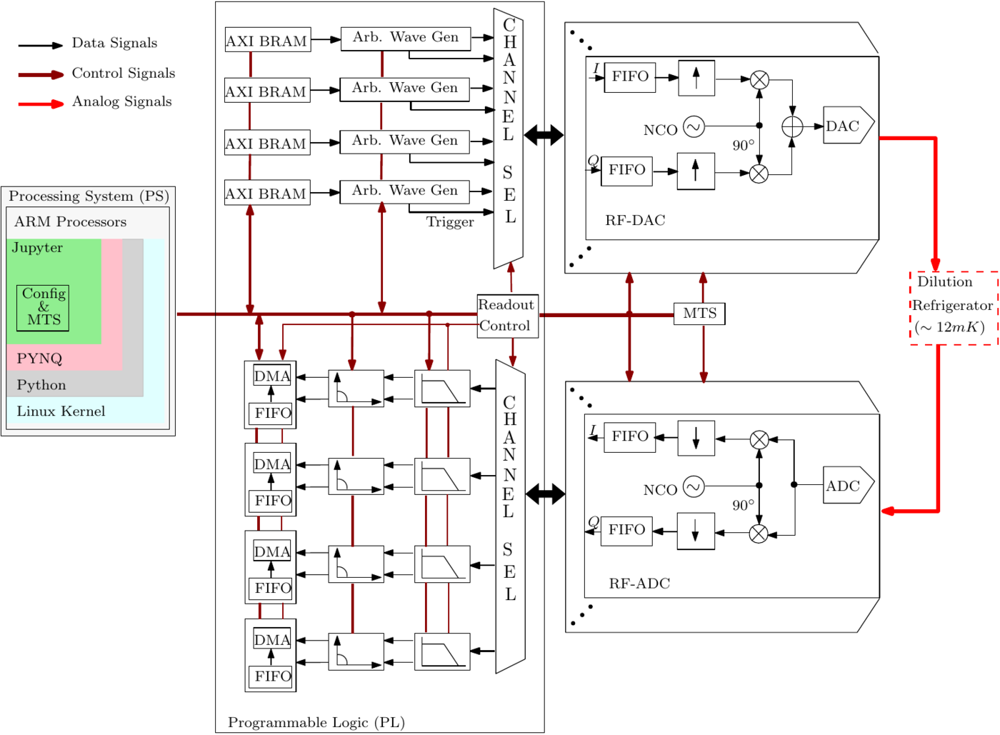

# SQ-CARS

A Scalable Quantum Control and Readout System, from IISc Bangalore. A fixed state machine runs
parameterized experiment loops, and the RFSoC's own NCOs and mixers do the frequency work.

| | |
|---|---|
| Group | IISc Bangalore: Department of Physics and the NeuRonICS Lab (Electronic Systems Engineering) |
| Board | ZCU111 with AMD's XM500 card |
| Code | [github.com/NeuRonICS-Lab/Quantum-Control-Electronics](https://github.com/NeuRonICS-Lab/Quantum-Control-Electronics) |
| Licence | none: no licence file, so no right to reuse is granted |
| Latest activity | last commit 2025-06-17; no tags |

Figure 1 of Singhal et al., [SQ-CARS](https://doi.org/10.1109/TIM.2023.3305656), IEEE Trans. Instrum. Meas. 72 (2023), from arXiv:2203.01523, CC BY 4.0. Rendered to PNG; otherwise unchanged.

## Hardware and converters

8 DACs (one tile for control, one for readout) and 8 ADCs, for up to 4 qubits. Characterized at
6.144 GS/s for the DACs and 3.840 GS/s for the ADCs, with a 192 MHz fabric clock and 64k samples
(80 µs) of waveform per channel. The DAC runs in mix mode to reach 4 to 9 GHz in the second
Nyquist zone, behind a band-pass filter ([Singhal 2023](https://doi.org/10.1109/TIM.2023.3305656),
Secs. II-B, II-C and III, Fig. 4).

## Real-time control

A fixed hardware state machine that runs parameterized loops (Algorithm 1); no programmable
processor ([Singhal 2023](https://doi.org/10.1109/TIM.2023.3305656), Sec. II).

## Signal generation and readout

A block-RAM waveform generator per DAC feeds the RF-DAC's NCO and digital IQ mixer; flat tops come
from a counter (Fig. 3). Readout: the RF-ADC's NCO down-converts and decimates, then a tunable IIR
low-pass filter, a moving average and a rotation; data goes by DMA to the ARM and on to a PC
([Singhal 2023](https://doi.org/10.1109/TIM.2023.3305656), Sec. II-D).

## Feedback and multi-board

Feedback is described as enabled, but no feedback experiment is reported. The DAC-to-ADC loopback
round trip is 48 cycles, 250 ns at 192 MHz, measured with an integrated logic analyzer. No
multi-board operation; on one board, DAC-to-DAC jitter is about 0.6 ps
([Singhal 2023](https://doi.org/10.1109/TIM.2023.3305656), Sec. III, Fig. 6).

## Software

Python classes on PYNQ 2.7 driven from Jupyter; Vivado 2020.2
([Singhal 2023](https://doi.org/10.1109/TIM.2023.3305656), Sec. III-E).

## Demonstrated with qubits

Fixed-frequency transmons in 3D cavities: Rabi, T1 and T2, compared with a conventional AWG on the
same device (T1 57 µs against 53 µs). The readout in these tests went through a Zurich Instruments
UHF and a home-built converter, not the RFSoC's ADCs
([Singhal 2023](https://doi.org/10.1109/TIM.2023.3305656), Sec. IV, Figs. 11 to 13).

## Openness, in detail

Bitstreams, hardware handoff files and a block-design Tcl script are public. The Tcl script asks for
custom RTL modules (the waveform generator, IIR filter, moving average) that are not in the
repository, so the gateware cannot be rebuilt from it.

## Worth knowing

The same group later put a neural-network state discriminator for 5 qubits on the ZCU111
([Gautam 2026](https://doi.org/10.1145/3814576.3814580)).
